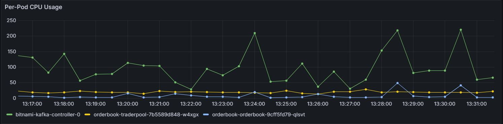
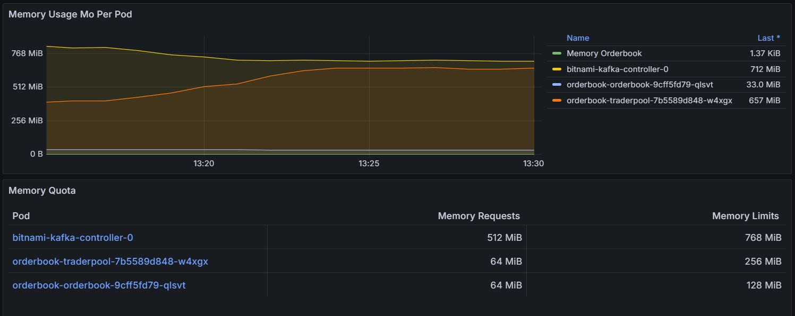

# OrderBook Monitoring with Grafana

Monitor an orderbook data generator using Grafana, built from the repository: [AdrienLibert/orderbook](https://github.com/AdrienLibert/orderbook).  

The orderbook project was developed in collaboration with [@ShikoteiCoding](https://github.com/ShikoteiCoding).

## Installation

### Dependencies

Install the required dependencies with the following commands:

```
make helm
make build_deps
```

### Start Monitoring

Launch the monitoring service:

```
make start_monitoring
```

Access the Grafana dashboard at:  
[http://localhost:30300/](http://localhost:30300/)

**Credentials:**
- Username: `admin`
- Password: `admin`

### Stop Monitoring

Stop the monitoring service:

```
make stop_monitoring
```

### CPU Usage per Pod


This chart illustrates the CPU consumption for each pod, allowing you to monitor resource utilization and identify performance bottlenecks.

### Memory Usage per Pod


This chart displays the memory usage for each pod, helping you track memory allocation and detect potential inefficiencies or leaks.